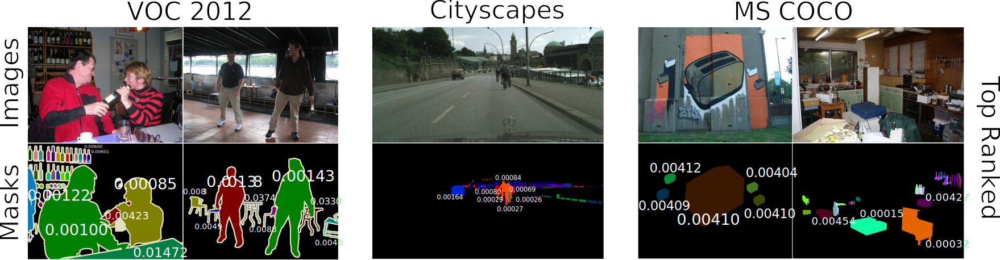

# Training-Free Dataset Pruning for Instance Segmentation
[[`Paper`](https://openreview.net/forum?id=rvxWEbTtRY) | [`BibTex`](#citation) | [`Logs`](https://drive.google.com/drive/folders/1pQfsCZdLt5nvxExtIhyNJqyIgHfX72Ga?usp=sharing)]

---

Official Implementation for "[Training-Free Dataset Pruning for Instance Segmentation](https://openreview.net/forum?id=rvxWEbTtRY)".

[Yalun Dai](https://scholar.google.com/citations?user=6XyNVowAAAAJ&hl=en),&nbsp; 
[Lingao Xiao](https://scholar.google.com/citations?user=MlNI5YYAAAAJ&hl=zh-CN),&nbsp; 
[Ivor Tsang](https://scholar.google.com/citations?user=rJMOlVsAAAAJ&hl=en),&nbsp; 
[Yang He](https://scholar.google.com/citations?hl=zh-CN&user=vvnFsIIAAAAJ)

> **Abstract**: Existing dataset pruning techniques primarily focus on classification tasks, limiting their applicability to more complex and practical tasks like instance segmentation.
Instance segmentation presents three key challenges: pixel-level annotations, instance area
variations, and class imbalances, which significantly complicate dataset pruning efforts.
Directly adapting existing classification-based pruning methods proves ineffective due to their reliance on time-consuming model training process. 
To address this, we propose a novel Training-Free Dataset Pruning (TFDP) method for instance segmentation. 
Specifically, we leverage shape and class information from image annotations to design a Shape Complexity Score (SCS),  refining it into a Scale-Invariant (SI-SCS) and Class-Balanced (CB-SCS) versions to address instance area variations and class imbalances, all without requiring model training.
We achieve state-of-the-art results on VOC 2012, Cityscapes, and MS COCO datasets, generalizing well across CNN and Transformer architectures. Remarkably, our approach accelerates the pruning process by an average of **1349** $\times$ on COCO compared to the adapted baselines.



<!--  -->

<!-- <table>
  <tr>
    <td colspan="2" style="width:70%; vertical-align:top;">
      <p><strong>Abstract</strong>: Existing dataset pruning techniques primarily focus on classification tasks, limiting their applicability to more complex and practical tasks like instance segmentation.
      Instance segmentation presents three key challenges: pixel-level annotations, instance area
      variations, and class imbalances, which significantly complicate dataset pruning efforts.
      Directly adapting existing classification-based pruning methods proves ineffective due to their reliance on time-consuming model training process. 
      To address this, we propose a novel <strong>Training-Free Dataset Pruning (TFDP)</strong> method for instance segmentation. 
      Specifically, we leverage shape and class information from image annotations to design a <strong>Shape Complexity Score (SCS)</strong>, refining it into a <strong>Scale-Invariant (SI-SCS)</strong> and <strong>Class-Balanced (CB-SCS)</strong> versions to address instance area variations and class imbalances, all without requiring model training.
      We achieve state-of-the-art results on VOC 2012, Cityscapes, and MS COCO datasets, generalizing well across CNN and Transformer architectures. Remarkably, our approach accelerates the pruning process by an average of <strong>1349</strong> &times; on COCO compared to the adapted baselines.</p>
    </td>
    <td style="vertical-align:top;">
      
    </td>
  </tr>
</table>  -->


## Installation
Our code is developed based on [MMDetection](https://github.com/open-mmlab/mmdetection/tree/main). Please refer to the official [Installation](https://mmdetection.readthedocs.io/en/latest/get_started.html). Or simply download using the provided scripts.

Step1: Git clone repo.
``` shell
git clone https://github.com/he-y/dataset-pruning-for-instance-segmentation.git
cd dataset-pruning-for-instance-segmentation
```

Step2: Install environment.
``` shell
conda create --name tfdp python=3.8 -y
conda activate tfdp
bash install_env.sh
```

## Download datasets
Download the dataset from the official link: [MS COCO](https://cocodataset.org/), [Cityscapes](https://www.cityscapes-dataset.com/), [Pascal VOC](http://host.robots.ox.ac.uk/pascal/VOC/voc2012/index.html). Or simply download using the provided scripts.

``` shell
cd mmdet_cityscapes_coco
python tools/misc/download_dataset.py --dataset-name coco2017
python tools/misc/download_dataset.py --dataset-name cityscapes --username 'your_user_name' --password 'your_password'
python tools/misc/download_dataset.py --dataset-name voc2012
```


## Training-Free Dataset Pruning

Main experiments. (Table 1 \& Table 2 \& Table 5 \& Table 8 \& Table 9 \& Table 13)
``` shell
# COCO, Cityscapes, and Cityscapes (COCO pre-trained)
cd mmdet_cityscapes_coco

bash mask-rcnn_r50_fpn_1x_coco_tfdp.sh
bash mask-rcnn_r50_fpn_1x_cityscapes_tfdp.sh
bash mask-rcnn_r50_fpn_1x_cityscapes_tfdp_coco_pretrain.sh
```

The precomputed CB-SCS is available on [Google Drive](https://drive.google.com/drive/folders/1gbFDPlTA_oT2gEiiwv0O55xdZJSKZDKF?usp=sharing) for your reference. Note that calculating it directly using our code takes less than 1 minute (depending on your hardware).

--------------------------------------------------------

Generalization and scalability experiments. (Table 3 \& Table 10 \& Table 11)
``` shell
# SOLO-V2, QueryInst, ResNet 101, and  ResNeXT 101
cd mmdet_cityscapes_coco

bash solov2_r50_fpn_1x_coco_tfdp.sh
bash queryinst_r50_fpn_1x_coco_tfdp.sh
bash mask-rcnn_r101_fpn_1x_coco_tfdp.sh
bash mask-rcnn_x101-32x4d_fpn_1x_coco_tfdp.sh
```

## Main Table Result ([📂Google Drive](https://drive.google.com/drive/folders/1pQfsCZdLt5nvxExtIhyNJqyIgHfX72Ga?usp=sharing))

Logs for main tables are results provided in [google drive](https://drive.google.com/drive/folders/1pQfsCZdLt5nvxExtIhyNJqyIgHfX72Ga?usp=sharing) for reference.

| Table                                                                                                          | Explanation                                                     |
| -------------------------------------------------------------------------------------------------------------- | --------------------------------------------------------------- |
| [Table 1 & Table 8](https://drive.google.com/drive/folders/1s8ZmeR71x4248nL8ce4VTu9hdW0474Oa?usp=sharing)  | Experiments on COCO |
| [Table 2 & Table 9](https://drive.google.com/drive/folders/1z2g2z4Y4DwCk_Z_QdWQebqsYvp3akrKB?usp=sharing)  | Experiments on Cityscapes and VOC                     |
| [Table 3 & Table 10](https://drive.google.com/drive/folders/1vHml-F5KmQ04rPjriqzlbchc_LYIDc1_?usp=sharing)  | Generalization experiments (Cross-architecture)                      |
| [Table 5 & Table 13](https://drive.google.com/drive/folders/1L0efuuSvI0kQ9m67-vLvKkxe7ZIbz_gb?usp=sharing)  | Experiments on Cityscapes (Pre-trained on COCO)                                              |
| [Table 11](https://drive.google.com/drive/folders/1tamzrhZadzmOInztB5yTl4THHOlxhlXN?usp=sharing)            | Scalability experiments (Different backbones)                        |
| [Figure 5](https://drive.google.com/drive/folders/1FYgRPi4PS9hkALBBXhBRQi1tIRtZCDpe?usp=sharing)   | Experiments on COCO (High pruning rates)|


## Citation

```
@inproceedings{dai2024tfdp,
  title={Training-Free Dataset Pruning for Instance Segmentation},
  author={Yalun Dai, Lingao Xiao, Ivor Tsang , and Yang He},
  booktitle={ICLR},
  year={2025}
}
```
